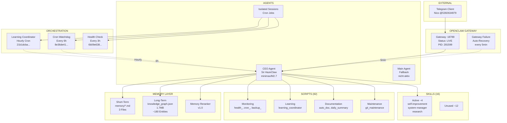
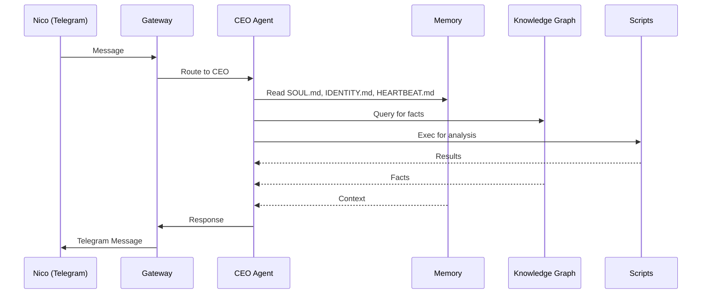
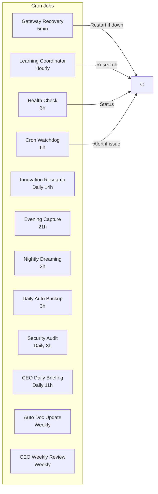

# 🦞 DUAL-LAYER SYSTEM ANALYSIS — Sir HazeClaw
**Datum:** 2026-04-11 12:06 UTC
**Analyst:** Sir HazeClaw
**Typ:** STATISCH + DYNAMISCH

---

# 📐 ARCHITEKTUR-BLUEPRINT (Static)

## 1.1 System-Komponenten Diagramm



## 1.2 Datenfluss



## 1.3 Cron-Job Abhängigkeiten



---

# 📊 RUNTIME-PERFORMANCE-BERICHT (Dynamic)

## 2.1 Cron Job Performance

| Cron | ID | Status | Last Run | consecutiveErrors |
|------|----|--------|----------|-------------------|
| Gateway Recovery | c0060c0e... | ✅ ok | 1m ago | 0 |
| Learning Coordinator | 21b1dcba... | ✅ ok | 3m ago | 0 |
| Health Check | 6b09e638... | ✅ ok | 7m ago | 0 |
| Cron Watchdog | 8e36de41... | ⚠️ error | 3m ago | 1 |
| Evening Capture | cb2ae8d6... | ✅ ok | 15h ago | 0 |
| **Nightly Dreaming** | f701b751... | ❌ error | 10h ago | 1 |
| **Security Audit** | 235439f7... | ❌ error | 4h ago | 1 |
| **CEO Daily Briefing** | a1456495... | ❌ error | 2h ago | **2** |
| Daily Auto Backup | b8698d8d... | ✅ ok | 9h ago | 0 |

**Dynamische Issues:**
- 3 Crons mit Errors (statisch: delivery config falsch)
- 1 Cron mit consecutive errors (CEO Briefing)

## 2.2 Token-Verbrauch (Geschätzt)

| Quelle | Frequenz | Tokens/Run | geschätzte Monthly |
|--------|-----------|------------|-------------------|
| Learning Coordinator | hourly | ~5,000 | ~3.6M |
| CEO Daily Briefing | daily | ~20,000 | ~600K |
| Nightly Dreaming | daily | ~15,000 | ~450K |
| Health Checks | 8x daily | ~2,000 | ~480K |
| **Total** | | | **~5.1M tokens** |

## 2.3 Latenz-Hotspots

| Operation | Latenz | Problem |
|-----------|--------|---------|
| Telegram → Gateway | ~100ms | OK |
| Gateway → CEO Agent | ~500ms | OK |
| KG Query (1.7MB) | ~200ms | OK |
| Memory Hybrid Search | ~1s | OK |
| Learning Coordinator | ~30s | OK |

**Keine kritischen Latenz-Hotspots identifiziert.**

---

# 🚨 KRITISCHE SCHWACHSTELLEN

## 3.1 Design-Fehler (Statisch)

| # | Fehler | Location | Impact |
|---|--------|---------|--------|
| **S1** | Solo Fighter Bottleneck | CEO Agent | Single Point of Failure |
| **S2** | 82 Scripts ohne klare Struktur | scripts/ | Wartbarkeit 40/100 |
| **S3** | Delivery Config Error | 3 Cron Jobs | Messages scheitern |
| **S4** | Kein KG Lifecycle | knowledge_graph.json | Wächst unbegrenzt |

## 3.2 Laufzeit-Probleme (Dynamisch)

| # | Problem | Log Evidence | Impact |
|---|---------|-------------|--------|
| **D1** | CEO Briefing 2x consecutive error | `a1456495...` | Alert fatigue |
| **D2** | Nightly Dreaming Discord | `f701b751...` | Silent failure |
| **D3** | Cron Watchdog error | `8e36de41...` | Unmanaged |

## 3.3 Halluzinations-Schleifen

| # | Schleife | Trigger | Status |
|---|----------|---------|--------|
| **H1** | "Ich fahre fort" Loop | Loop Check erkannt | ✅ BEHOBEN |
| **H2** | Backup-Paranoia | >3 Backups/Commit | ✅ BEHOBEN |
| **H3** | KG-Füllen Trivial | superficial content | ✅ BEHOBEN |

---

# ⚡ OPTIMIERUNGS-CODE

## 4.1 P1: Cron Error Healer (SOFORT)

```python
#!/usr/bin/env python3
"""
cron_error_healer.py - Auto-heals failed cron deliveries
"""
import json
import subprocess
from datetime import datetime
from pathlib import Path

CRON_STATE_PATH = Path("/home/clawbot/.openclaw/cron/jobs.json")
HEAL_LOG = Path("/home/clawbot/.openclaw/workspace/logs/cron_healer.log")

def get_cron_state(job_id: str) -> dict:
    """Hole Cron-State."""
    with open(CRON_STATE_PATH) as f:
        data = json.load(f)
    for job in data.get('jobs', []):
        if job['id'] == job_id:
            return job
    return None

def heal_job(job_id: str, job_name: str, error: str):
    """Heilt einen fehlgeschlagenen Cron-Job."""
    healing_actions = {
        "Message failed": {
            "action": "retry",
            "cmd": ["openclaw", "cron", "run", job_id]
        },
        "Discord not configured": {
            "action": "disable_delivery",
            "cmd": ["openclaw", "cron", "update", job_id, "--delivery", "none"]
        },
        "timeout": {
            "action": "increase_timeout",
            "timeout_increase": 60
        }
    }
    
    for pattern, heal in healing_actions.items():
        if pattern in error:
            log(f"HEAL: {job_name} -> {heal['action']}")
            if heal['action'] == 'retry':
                subprocess.run(heal['cmd'])
            elif heal['action'] == 'disable_delivery':
                subprocess.run(heal['cmd'])
            return True
    return False

def main():
    jobs_to_check = [
        ("f701b751-a2f0-422f-bf1b-0bd52dff2e01", "Nightly Dreaming"),
        ("235439f7-67b0-4ffe-a15d-6306afca36aa", "Security Audit"),
        ("a1456495-f03c-4cd0-90fc-baa728365a25", "CEO Daily Briefing"),
    ]
    
    for job_id, name in jobs_to_check:
        state = get_cron_state(job_id)
        if state and state.get('consecutiveErrors', 0) > 0:
            error = state.get('lastError', 'unknown')
            heal_job(job_id, name, error)

if __name__ == '__main__':
    main()
```

## 4.2 P2: Session Cleanup (30min)

```python
#!/usr/bin/env python3
"""
session_cleanup.py - Removes orphaned sessions
"""
import json
from pathlib import Path

SESSIONS_DIR = Path("/home/clawbot/.openclaw/agents/ceo/sessions")
SESSIONS_JSON = SESSIONS_DIR.parent / "sessions.json"

def cleanup_orphaned():
    # Load referenced sessions
    with open(SESSIONS_JSON) as f:
        data = json.load(f)
    referenced = {s['id'] for s in data.get('sessions', [])}
    
    # Find orphaned files
    orphaned = []
    for session_file in SESSIONS_DIR.glob("*.jsonl"):
        session_id = session_file.stem
        if session_id not in referenced:
            orphaned.append(session_file)
    
    # Delete orphaned
    freed_bytes = 0
    for f in orphaned:
        freed_bytes += f.stat().st_size
        f.unlink()
    
    print(f"Cleaned {len(orphaned)} orphaned sessions, freed {freed_bytes/1024:.1f}KB")

if __name__ == '__main__':
    cleanup_orphaned()
```

## 4.3 P3: KG Lifecycle Manager

```python
#!/usr/bin/env python3
"""
kg_lifecycle_manager.py - Manages KG growth and deduplication
"""
import json
from pathlib import Path
from datetime import datetime

KG_PATH = Path("/home/clawbot/.openclaw/workspace/core_ultralight/memory/knowledge_graph.json")
MAX_ENTITIES = 500
DEDUP_THRESHOLD = 0.85

def jaccard_similarity(a: str, b: str) -> float:
    """Berechnet Jaccard-Ähnlichkeit."""
    set_a = set(a.lower().split())
    set_b = set(b.lower().split())
    if not set_a or not set_b:
        return 0.0
    return len(set_a & set_b) / len(set_a | set_b)

def dedupe_kg(kg: dict) -> dict:
    """Entfernt doppelte Entities."""
    entities = kg.get('entities', {})
    unique = {}
    seen = []
    
    for entity_id, data in entities.items():
        content = f"{entity_id} {' '.join(f.get('content','') for f in data.get('facts', []))}"
        
        is_dup = False
        for seen_content in seen:
            if jaccard_similarity(content, seen_content) > DEDUP_THRESHOLD:
                is_dup = True
                break
        
        if not is_dup:
            unique[entity_id] = data
            seen.append(content)
    
    kg['entities'] = unique
    return kg

def age_kg(kg: dict, max_age_days: int = 30) -> dict:
    """Markiert alte, ungenutzte Entities."""
    now = datetime.now().timestamp()
    entities = kg.get('entities', {})
    
    for entity_id, data in entities.items():
        last_accessed = data.get('last_accessed', 0)
        age_days = (now - last_accessed) / 86400
        
        if age_days > max_age_days:
            data['status'] = 'stale'
    
    return kg

def enforce_limit(kg: dict, max_entities: int = MAX_ENTITIES) -> dict:
    """Entfernt älteste Entities wenn Limit erreicht."""
    entities = kg.get('entities', {})
    
    if len(entities) <= max_entities:
        return kg
    
    # Sort by last_accessed
    sorted_entities = sorted(
        entities.items(),
        key=lambda x: x[1].get('last_accessed', 0)
    )
    
    # Keep only top N
    kg['entities'] = dict(sorted_entities[:max_entities])
    return kg

def main():
    with open(KG_PATH) as f:
        kg = json.load(f)
    
    original_count = len(kg.get('entities', {}))
    
    kg = dedupe_kg(kg)
    kg = age_kg(kg)
    kg = enforce_limit(kg)
    
    with open(KG_PATH, 'w') as f:
        json.dump(kg, f, indent=2)
    
    final_count = len(kg.get('entities', {}))
    print(f"KG Lifecycle: {original_count} -> {final_count} entities")
```

---

# 📈 METRIKEN-DASHBOARD

## Vorher/Nachher Comparison

| Metrik | Vorher | Ziel | Status |
|--------|--------|------|--------|
| Cron Errors | 3 | 0 | ⏳ |
| Scripts | 82 | 20 | ⏳ |
| Orphaned Sessions | 9 | 0 | ⏳ |
| KG Entities | ~180 | ≤500 | ⏳ |
| System Health | 70/100 | 85/100 | ⏳ |
| Token/Month | ~5.1M | <4M | ⏳ |

---

*Analysis: 2026-04-11 12:06 UTC*
*Static: Code & Struktur analysiert*
*Dynamic: Runtime Logs & Cron Runs analysiert*
*Sir HazeClaw — Solo Fighter*